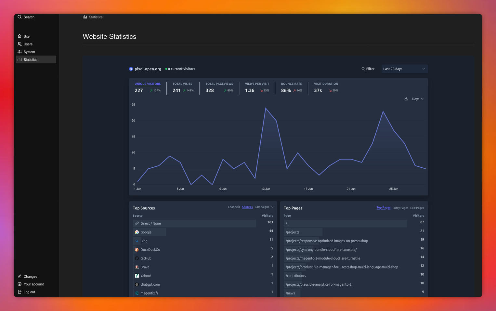

<h1 align="center">
Plausible Bundle for Kirby CMS
</h1>
<div align="center">
This bundle allows you to integrate Plausible analytics statistics into the Kirby CMS administration interface via an embedded iframe.

[](https://php.net/)
[](https://getkirby.com/)
[](https://github.com/Pixel-Open/kirby-plausible/releases)

</div>



This plugin take a lot of inspiration on this plugin: https://github.com/floriankarsten/kirby-plausible

## Commercial Usage

This plugin is free

## Installation

### Download

[Download the files](https://github.com/Pixel-Open/kirby-plausible/releases/tag/1.0.2.zip) and place them inside `site/plugins/kirby-plausible`.

### Composer

```
composer require pixelopen/kirby-plausible
```

### Git Submodule

You can add the plugin as a Git submodule.

    $ cd your/project/root
    $ git submodule add https://github.com/Pixel-Open/kirby-plausible.git site/plugins/kirby-plausible
    $ git submodule update --init --recursive
    $ git commit -am "Add Kirby plausible plugin"

Run these commands to update the plugin:

    $ cd your/project/root
    $ git submodule foreach git checkout master
    $ git submodule foreach git pull
    $ git commit -am "Update submodules"
    $ git submodule update --init --recursive

## Options

You need to add the url of your website plausible.io page with the following line in your `/site/config/config.php`:

```php
return [
    'pixelopen.plausible' => [
        'plausibleLink' => 'https://plausible.io/share/your.website?auth=yourAuthID',
    ],
];
```

You can change the height of the iframe (default = 2000) with the following line in your `/site/config/config.php`:

```php
return [
    'pixelopen.plausible' => [
        'height_iframe' => 'iframe_height_value',
    ],
];
```
